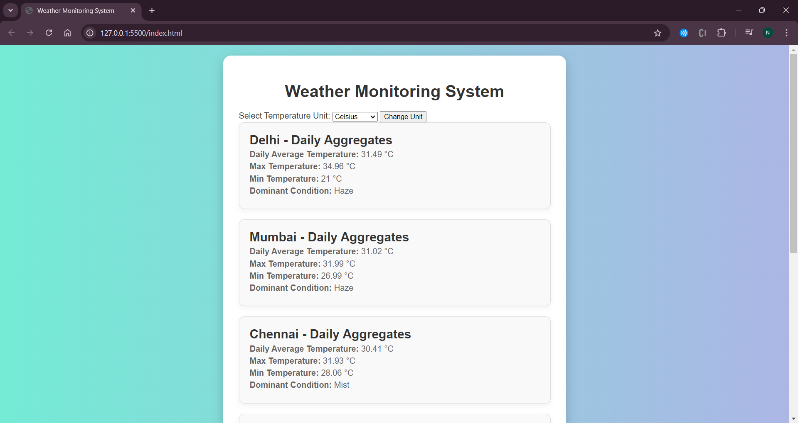

This is a weather app which calculates daily average, max, min and dominant condition based on data taken at regular intervals daily.
 
Cities which are included are Delhi, Mumbai, Chennai, Bangalore, Kolkata, Hyderabad. 
It has capability to send alerts whenever threshold is breached.
 

## Tech Stack
The backend is built with Spring Boot, while the frontend utilizes HTML CSS JavaScript. The database in use is MySQL.

## Pre-Requisite - 
1. An IDE of your choice (IntelliJ used here)
2. Java (min v17)
3. Maven
4. MYSQL Workbench
   
## How to Run -
1. Clone repo using  `https://github.com/Neel901/WeatherApp.git`
2. To run the db:
    1. Connect to mysql server at `localhost:3306`
    2. Create database & table using `db.sql` file.
3. To run the server:
    1. Import the `DailyWeather` directory in IntelliJ or Eclipse.
    2. Run `mvn clean install`
    3. Add run/debug configurations in IntelliJ.
    4. Add a new configuration for Application as shown -
    5. 
    6. Run the server
    7. Use the curl to verify the server is up `curl --location 'localhost:8080/actuator/health'`
    8. Postman api collection is available in file `weatherapp.postman_collection.json` 
4. To run the frontend:
    1. Open the `frontend` directory in VS Code.
    2. Make sure you have `Live Server` extension added in VS Code.
    3. Now open `frontend/index.html` file with `Live Server`.
    4. You should be seeing weather data now.
  
## Enhancements - 
1. Logging enabled.
2. Added actuator health check.
3. Added request field validations.
